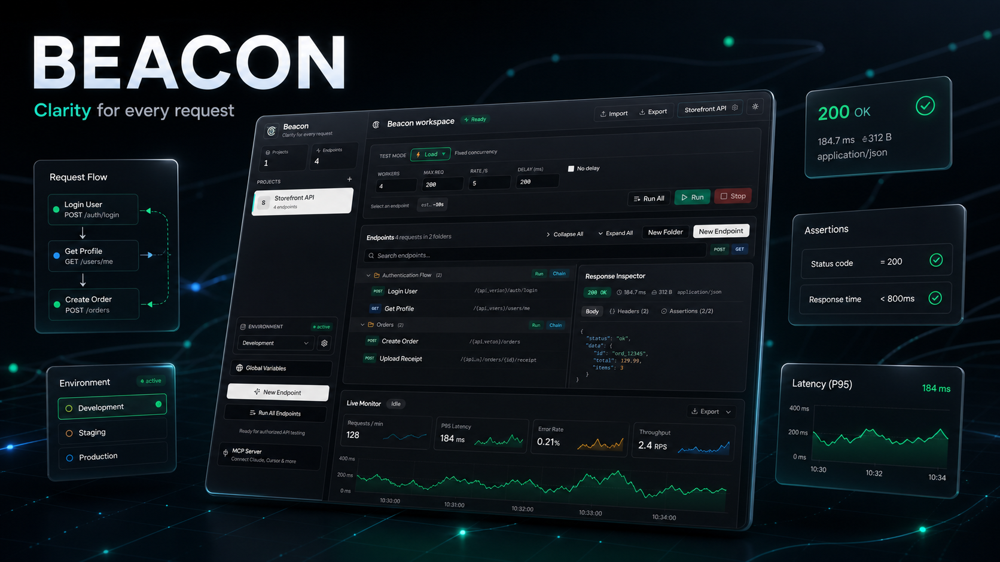
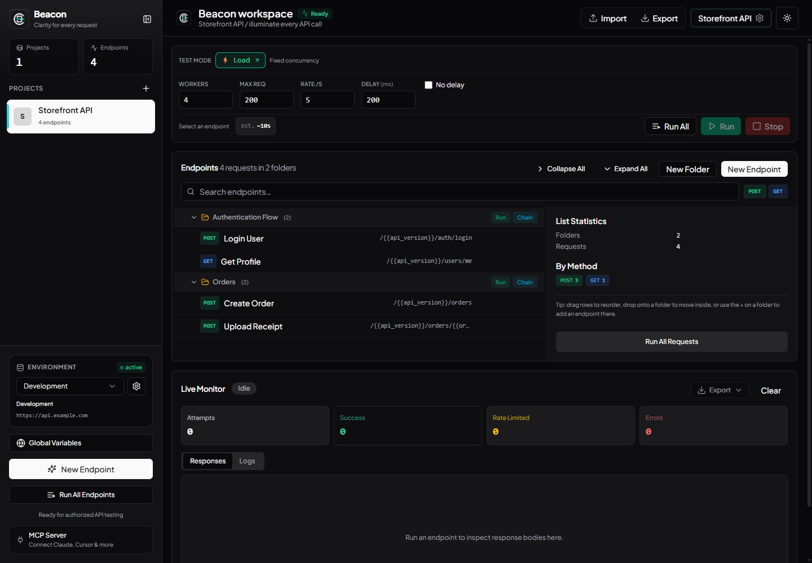
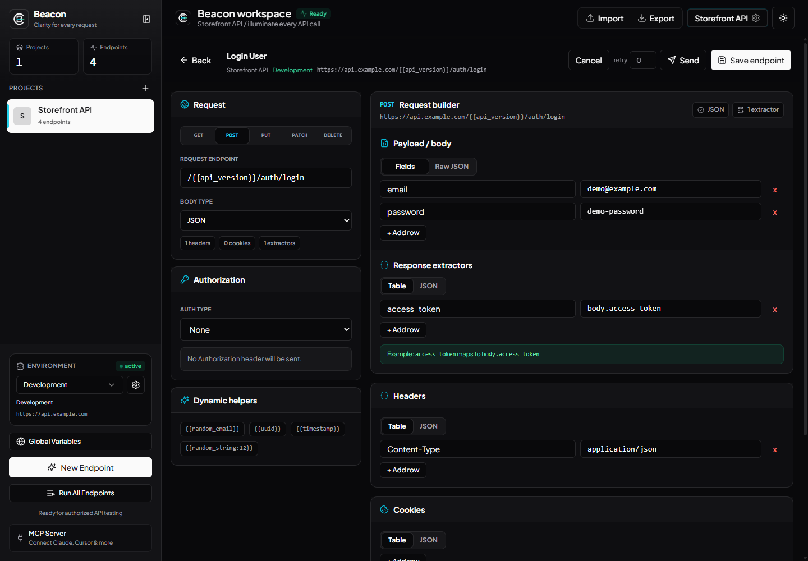
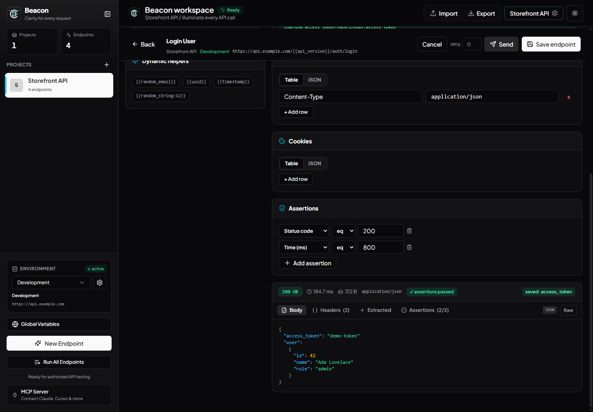
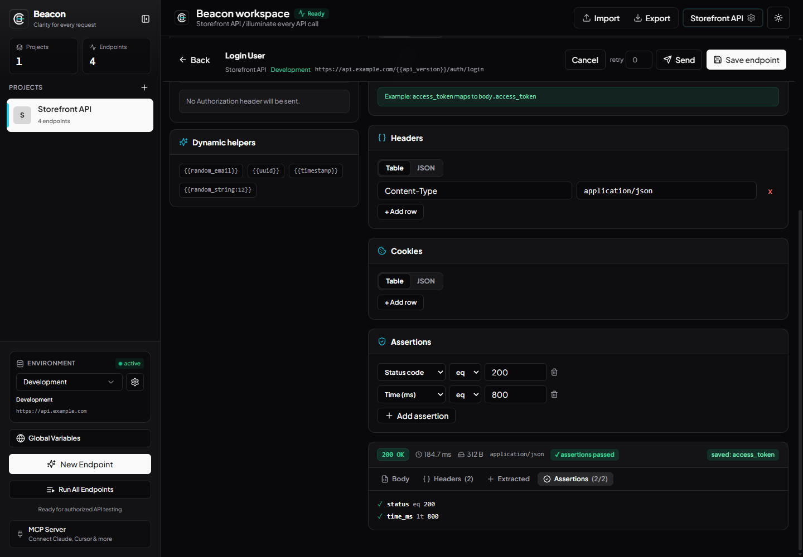
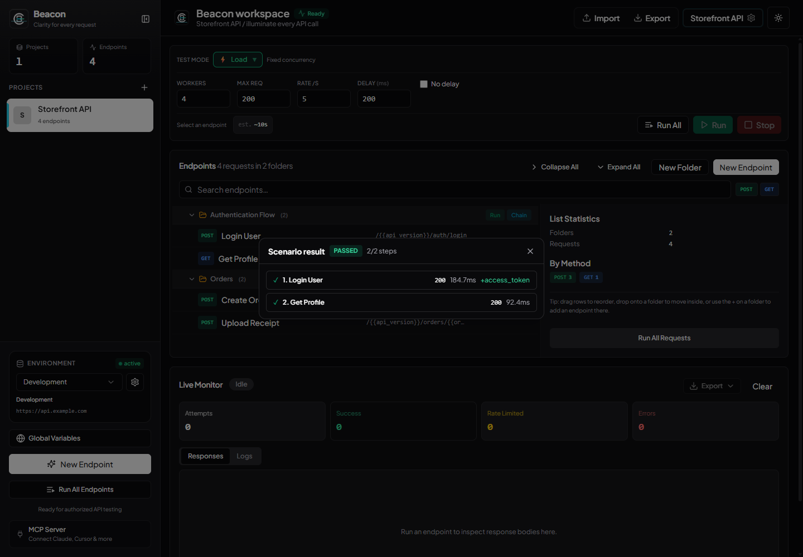
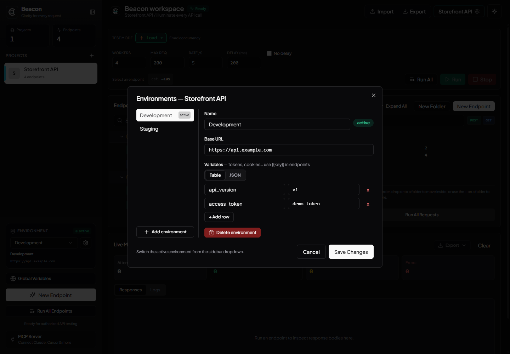

# Beacon

**Beacon** is a modern API workspace for building requests, chaining API flows, validating responses, and running authorized load and rate-limit tests.

Built with React, TypeScript, Vite, shadcn/ui, FastAPI, and an optional Tauri desktop shell.



## Product Preview

### Organized API workspace

Manage multiple projects and environments, group endpoints in nested folders, select a test mode, and monitor runs from one workspace.



### Dynamic request builder

Build JSON, form, multipart, or raw requests with environment variables, generated values, authentication helpers, headers, cookies, and response extractors.



### Send and inspect a response

Send a single request before starting a load test. Inspect status, latency, size, headers, parsed JSON, extracted variables, and assertion results. JSON fields can be promoted to extractors directly from the response.



### Assertions and chained scenarios

Attach pass/fail rules to an endpoint, then run folders as ordered scenarios. Extracted values are carried into later steps, with retry and continue-on-error controls available for chained flows.





### Projects and environments

Keep base URLs and variables separate across development, staging, and other environments without duplicating endpoint definitions.



## Features

- Project workspaces with nested, draggable request folders
- Ready-to-run JSONPlaceholder sample with 47 organized CRUD, filter, and relation requests
- Environment and global variables using `{{variable}}` templates
- Fresh-per-request generators such as `{{random_email}}`, `{{uuid}}`, `{{timestamp}}`, and `{{random_string:12}}`
- Postman collection import and redacted project export
- JSON, form, multipart, and raw request bodies
- Per-endpoint authentication, headers, cookies, extractors, and run overrides
- Single Send with a structured Response Inspector and click-to-extract JSON fields
- Assertions for status, response time, body content, JSON fields, and headers
- Ordered scenarios with extractor-based state chaining and retries
- Load, Ramp, Spike, Soak, Rate Probe, Fuzz, Benchmark, and Scenario test modes
- Live attempts, successes, rate limits, errors, response logs, latency trend, and exportable results
- Local Run History with pinning, filters, expandable charts, and semantic two-run comparison
- Desktop app via Tauri with bundled FastAPI and MCP sidecars
- Standard MCP server for Claude, Cursor, Windsurf, Cline, Continue, and other MCP clients

## Quick Start

### One-time setup

```bash
# pnpm (recommended)
pnpm run setup

# Windows alternative
setup.bat
```

### Start the app

```bash
pnpm dev
```

The launcher reads ports from the root `.env` and starts:

- FastAPI backend: <http://localhost:8000>
- React frontend: <http://localhost:5173>
- VitePress docs: <http://localhost:5174/docs/>
- Landing page: <http://localhost:5175>

On a fresh install, Beacon opens a conservative JSONPlaceholder sample project
with six resource folders and 47 requests. Existing workspaces are never
replaced; use **Add Sample Project** in the sidebar to add or reopen it.

To start individual services:

```bash
pnpm run dev:backend
pnpm run dev:frontend
pnpm run dev:docs
```

### Manual setup

```bash
# Backend
cd backend
pip install -r requirements.txt
python -m uvicorn app.main:app --reload --port 8000

# Frontend (new terminal)
cd frontend
pnpm install
pnpm dev
```

## MCP Server

Beacon includes a standard stdio MCP server that can list and manage projects, folders, and endpoints; import collections; send individual requests; and run endpoints or chained scenarios.

In the desktop app, open **MCP Server** to register Beacon with a supported client or copy a ready-to-use configuration. See [MCP Server documentation](./docs/mcp.md) for setup and the available tools.

## Documentation

The full VitePress documentation lives in [`docs/`](./docs/index.md).

```bash
pnpm run dev:docs
pnpm run docs:build
pnpm run docs:preview
```

## Security

Use Beacon only against systems you own or are explicitly authorized to test. Local configuration can contain live URLs, cookies, bearer tokens, and other credentials; `config/tests.json` is ignored by Git and must remain private.
